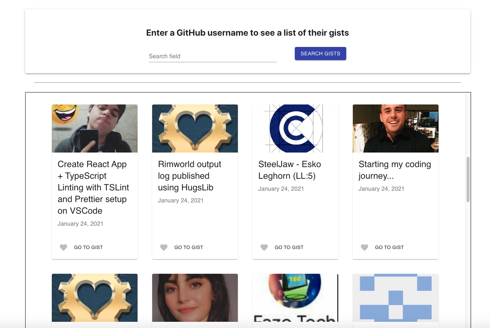
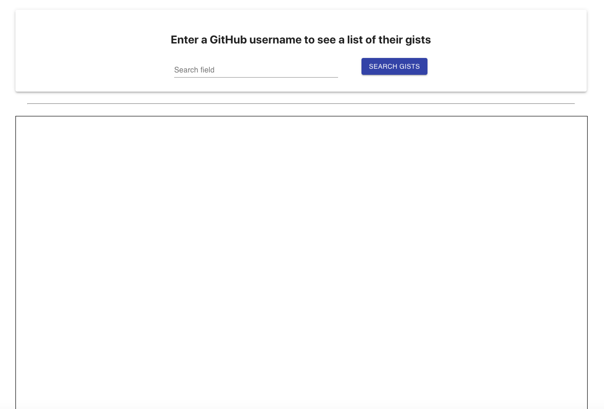
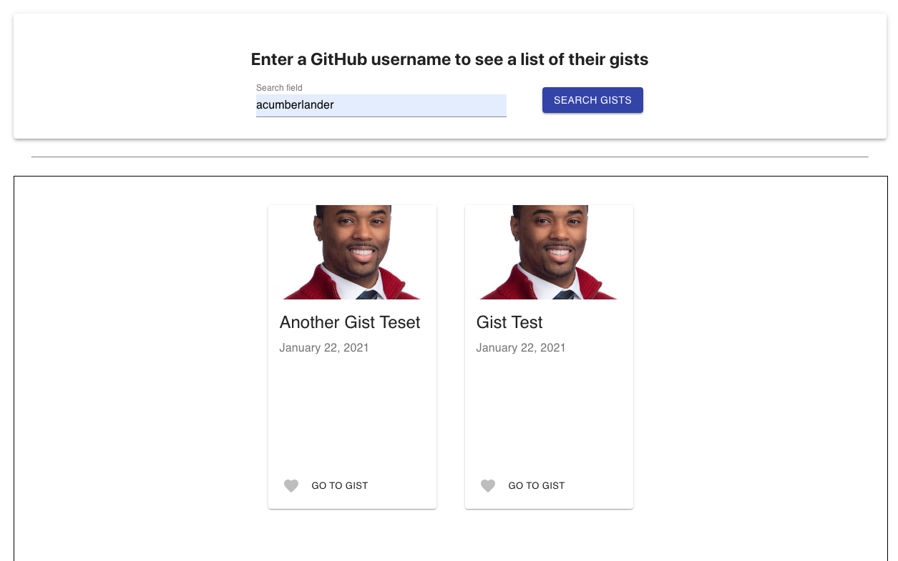
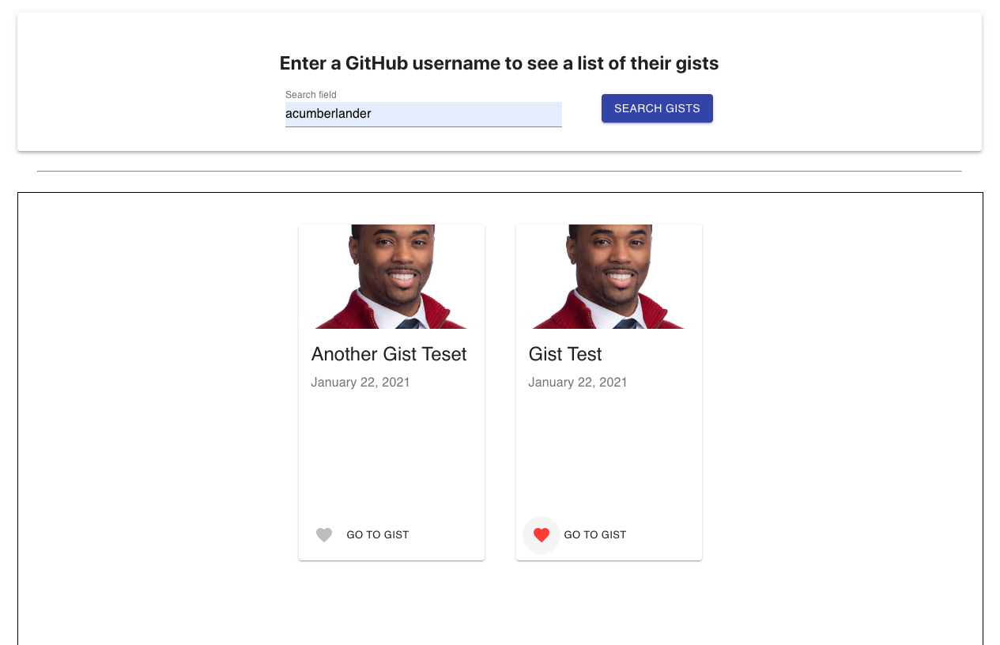
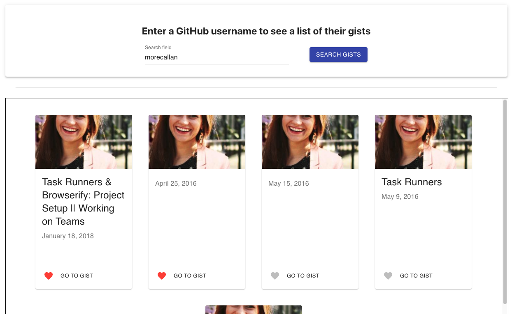

# Github Gists Favorites

This project is an application that will allow the user to
fetch a Github user's gists and favorite the ones they like.

## Product Requirements:

- [x] The front-end application should communicate with Github to fetch a user’s gists.
- [x] The front-end application should favorite and locally persist your favorites across users.
- [x] The front-end application can call the API anonymously or with a defined user.
- [x] The front-end application can use a component framework to help with your layout.

## Engineering requirements:

- [x] The favoriting logic in your application should have tests.
- [x] The favorites should be persisted across searches.
- [x] Please write up a small explanation of how you would extend or improve your
      application design if you were building this for production.
- [x] Please make this code easy to access. A repository would be great.



## Necessary Installs

Cloning this repository down to your local machine and then running

```
npm install
```

should download all of the needed node packages. But just in case that doesn't work, here are all of the packages/libraries used for the project.

#### React

#### React-Hook-Form

#### React-Dom

#### Jest

#### Enzyme

#### Axios

#### Moment

#### @material-ui/core

#### @material-ui/icons

### Run this command to install them all at once.

```
npm install react react-dom react-hook-form jest enzyme axios moment @material-ui/core @material-ui/icons
```

## Working through the application

- Once you have all of the necessary packages downloaded you'll want to spin up the application by running

```
npm start
```

- When the app loads up it should like the following:



- Once the app is spun up, if you click on the 'Search Gists' button without entering a GitHub username, a list of gists from random users will render like so:


- If you type a username into the input and click the 'Search Gists' button, then you will be shown all the public gists available for that user.



- If you click on the heart icon on one of the gists it will change color to indicate that you have 'favorited' or 'liked' the gist.



- If you search for other user gists and like the ones that display the functionality will work the same. Also, if you go back to the user you were on previously you'll notice that your previously liked/favorited gists are still marked as such.



- If you click on the 'Go to Gist' button, you'll be taken to the gist on that user's GitHub account.

## Improvements for Production

If this were a feature that needed to be added to production, I probably would have taken more time on trying to map out additional UI features. For example, I think it would have been cool if instead of the user's gists being the only thing to populate on search, a user profile could have been provided as a side drawer. That side drawer could have other options that would allow the user to see their repos, followers, following, etc. Another possible design/feature addition would be to allow the user to see all of their files for each gist displayed within the app.

## That's all Folks!
